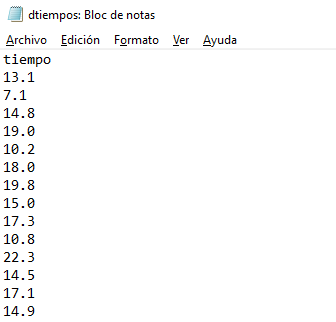

```{r setup, include=FALSE}
knitr::opts_chunk$set(echo = TRUE)
```

## Básico

Tenemos el siguiente archivo de extensión .txt:

<p>

<p>

Para cargar el archivo a R:
```{r}
datos<- read.table("dtiempos.txt", header=TRUE) 
```

```header = TRUE``` Indica que el archivo posee encabezado, en este caso el header es **tiempo**


Cargar el archivo manualmente:
```{r echo=TRUE, results='hide'}
# datos2 <- read.table(file.choose(), header=TRUE)
```

Luego los datos que estaban en el archivo ```dtiempos.txt``` quedaron almacenada en la variable ```datos```. A esta variable podemos hacer una variedad de operaciones, dentro de las cuales tenemos:

### Resumen de la base de datos
```{r}
summary(datos)
```

Dentro de los datos, se pueden tener distintas variables, en este caso solo está la variable ```tiempo```, definiendola en ```a```:


```{r}
a <- table(datos$tiempo)
```

Para abarcar todas las variables de manera automática:

```{r}
attach(datos)
```

Consultas a variable ```tiempo```:

**Promedio**
```{r echo=TRUE, results='hide'}
mean(tiempo)
```

**Mediana**
```{r echo=TRUE, results='hide'}
median(tiempo)
```


**Varianza**
```{r echo=TRUE, results='hide'}
var(tiempo)
```

**Desviación estándar**
```{r echo=TRUE, results='hide'}
sd(tiempo)
```

**Longitud**
```{r echo=TRUE, results='hide'}
length(tiempo)
```

**Cuartiles**
```{r echo=TRUE}
quantile(tiempo)
```

**Percentiles puntuales**
  * ejemplo: 15%, 20%, 45%, 90%
```{r echo=TRUE}
quantile(tiempo, c(.15, .2, .45, .90))
```

**Deciles**
```{r echo=TRUE}
quantile(tiempo, probs=seq(from=0, to=1, by=0.1))
```

**RIC** $(Q_3 - Q_1)$
```{r echo=TRUE, results='hide'}
IQR(tiempo)
```

## Gráficos

**Histograma (default)**
```{r echo=TRUE}
hist(tiempo)
```


**Histograma con parámetros**

* ```main="Histograma de tiempo```: Título del histograma
* ```col="lightcyan"```: Color del las barras del histograma
* ```xlab="Tiempo (minutos)"```: Nombre eje $x$
* ```ylab="Frecuencia"```: Nombre eje $y$

```{r echo=TRUE}
hist(tiempo, main="Histograma de tiempo", col="lightcyan", xlab="tiempo (min)", ylab="frecuencia")
```

**Diagrama de caja**
```{r echo=TRUE}
boxplot(tiempo, main="Diagrama de caja de tiempo", col="lightcyan", ylab="tiempo (min)")
```
```{r echo=TRUE}
boxplot(tiempo, horizontal = TRUE)
```


**Diagrama de tallo y hoja (default)**

```{r echo=TRUE}
stem(tiempo)
```

**Diagrama de tallo y hoja con parámetros**
```{r echo=TRUE, warning=FALSE}
stem(tiempo, seq(from=4, to=27, by=1))
```

***

Bibliografía y sitios de interés:

* [https://www.rstudio.com/wp-content/uploads/2015/03/rmarkdown-spanish.pdf](https://www.rstudio.com/wp-content/uploads/2015/03/rmarkdown-spanish.pdf)
* https://rpubs.com/osoramirez/93049
* https://rpubs.com/Charlie_A/
* https://www.calvin.edu/~rpruim/courses/s341/S17/from-class/MathinRmd.html
* http://zevross.com/blog/2017/06/19/tips-and-tricks-for-working-with-images-ad-figures-in-r-markdown-documents/
* https://tex.stackexchange.com/questions/339191/is-it-possible-to-write-the-symbol-in-text-in-latex
* https://cran.r-project.org/doc/contrib/grafi3.pdf
* http://www.dma.ulpgc.es/profesores/personal/stat/cursoR4ULPGC/9c-grafHistograma.html
* https://picandoconr.wordpress.com/2016/02/08/graficos-con-r-histogramas/
